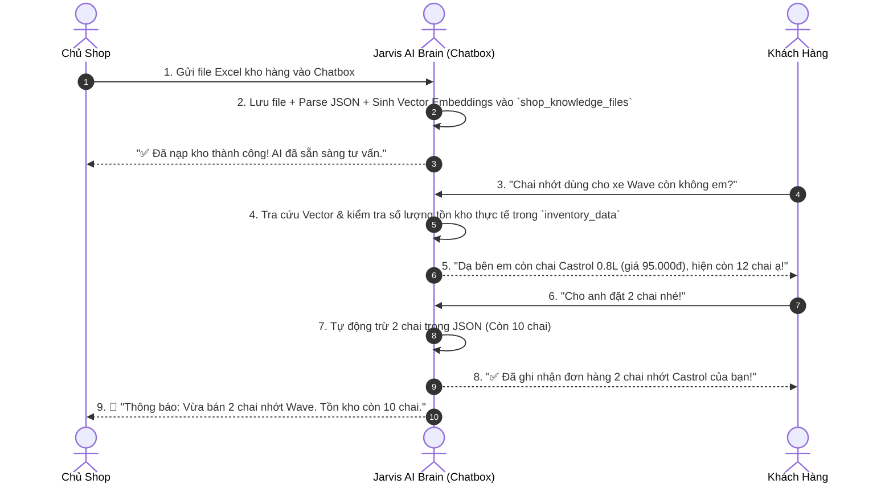

# HỆ THỐNG AI QUẢN LÝ KHO HÀNG & TƯ VẤN BÁN HÀNG ĐA SHOP (SINGLE-TABLE RAG)

> **Mục đích dự án**: Giải pháp thay thế phòng Marketing & Bán hàng tự động cho nhiều shop với chi phí vận hành siêu thấp (Ultra-low cost). Chủ shop chỉ cần gửi file Excel kho hàng vào Chatbox, AI tự học dữ liệu, tự động tư vấn khách hàng, tự trừ kho khi chốt đơn và gửi thông báo biến động kho về cho chủ shop.

---

## 🏗️ 1. Cấu trúc Database (1 Bảng Duy Nhất trên Supabase)

Hệ thống gom toàn bộ dữ liệu của tất cả các shop vào **1 bảng duy nhất** `shop_knowledge_files`, giúp loại bỏ hoàn toàn nguy cơ xung đột dữ liệu giữa các shop và tiết kiệm tối đa tài nguyên.

```sql
-- Bật extension vector
CREATE EXTENSION IF NOT EXISTS vector;

-- BẢNG DUY NHẤT QUẢN LÝ FILE, KHO HÀNG & VECTOR ĐA SHOP
CREATE TABLE IF NOT EXISTS shop_knowledge_files (
    id TEXT PRIMARY KEY,
    shop_id VARCHAR(100) NOT NULL,               -- Mã nhận diện riêng của từng Shop (VD: shop_01, shop_honda)
    file_name VARCHAR(255) NOT NULL,              -- Tên file gửi qua chat (VD: kho_nhot_wave.xlsx)
    file_path TEXT NOT NULL,                      -- Đường dẫn file đã lưu trên server
    file_type VARCHAR(50) DEFAULT 'excel',        -- excel, csv, text, pdf
    inventory_data JSONB DEFAULT '[]'::jsonb,     -- Dữ liệu sản phẩm & số lượng tồn kho (JSON)
    semantic_chunks TEXT,                         -- Văn bản mô tả để AI học
    embedding VECTOR(768),                        -- Vector AI ngữ nghĩa (Gemini text-embedding-004)
    notifications JSONB DEFAULT '[]'::jsonb,      -- Lịch sử thông báo biến động kho gửi chủ shop
    created_at TIMESTAMPTZ DEFAULT NOW(),
    updated_at TIMESTAMPTZ DEFAULT NOW()
);

-- Index tối ưu tra cứu theo Shop
CREATE INDEX IF NOT EXISTS idx_shop_knowledge_shop_id ON shop_knowledge_files(shop_id);
```

---

## 🔄 2. Luồng Hoạt Động Toàn Trình



---

## 📂 3. Danh Sách Các File Đã Tạo & Chỉnh Sửa

| Đường dẫn file | Vai trò & Chức năng |
| :--- | :--- |
| [`src/repositories/shopKnowledge.repository.js`](file:///d:/GIAHUY/jarvis-ai-brain/src/repositories/shopKnowledge.repository.js) | Repository quản lý bảng `shop_knowledge_files` (CRUD, Vector Cosine Search, trừ kho trong JSONB, phân tách dữ liệu đa shop). |
| [`src/services/inventory/excelParser.service.js`](file:///d:/GIAHUY/jarvis-ai-brain/src/services/inventory/excelParser.service.js) | Đọc file Excel/CSV, map thông minh các cột tiếng Việt (*Tên sản phẩm, Dòng xe tương thích, Tồn kho, Giá bán, Vị trí...*). |
| [`src/services/ai/chatFileHandler.service.js`](file:///d:/GIAHUY/jarvis-ai-brain/src/services/ai/chatFileHandler.service.js) | Xử lý khi chủ shop gửi file qua chatbox: lưu file, trích xuất dữ liệu, gọi Gemini Embedding và lưu vào DB. |
| [`src/services/ai/shopChatbot.service.js`](file:///d:/GIAHUY/jarvis-ai-brain/src/services/ai/shopChatbot.service.js) | Xử lý logic AI trả lời khách hàng, kiểm tra tồn kho thời gian thực, chốt đơn và gửi thông báo cho chủ shop. |
| [`src/providers/gemini/tools/inventory.tool.js`](file:///d:/GIAHUY/jarvis-ai-brain/src/providers/gemini/tools/inventory.tool.js) | Khai báo Tool `check_warehouse_inventory` và `update_warehouse_stock` cho Gemini Function Calling. |
| [`src/controllers/inventory.controller.js`](file:///d:/GIAHUY/jarvis-ai-brain/src/controllers/inventory.controller.js) | Controller xử lý các request HTTP (Upload file qua chat, chat khách hàng, chốt đơn, xem cảnh báo). |
| [`src/routes/inventory.route.js`](file:///d:/GIAHUY/jarvis-ai-brain/src/routes/inventory.route.js) | Định tuyến các API endpoint cho kho hàng và Chatbox. |
| [`src/routes/index.js`](file:///d:/GIAHUY/jarvis-ai-brain/src/routes/index.js) | Tích hợp router `/api/inventory` vào luồng ứng dụng chính. |
| [`public/shop-test.html`](file:///d:/GIAHUY/jarvis-ai-brain/public/shop-test.html) | Giao diện Web Test trực quan trên Localhost dành cho cả Chủ Shop và Khách Hàng. |
| [`scripts/test-shop-demo.js`](file:///d:/GIAHUY/jarvis-ai-brain/scripts/test-shop-demo.js) | Kịch bản chạy kiểm thử tự động toàn trình trên Terminal. |
| [`tests/unit/singleTableShopKnowledge.test.js`](file:///d:/GIAHUY/jarvis-ai-brain/tests/unit/singleTableShopKnowledge.test.js) | Bộ Unit Test đảm bảo chất lượng và tính cô lập giữa các shop. |

---

## 🌐 4. Danh Sách API Endpoints

### 1. Dành cho Chủ Shop nạp file qua Chatbox
- **`POST /api/inventory/chat-upload`**
- **Body (JSON):**
  ```json
  {
    "shop_id": "shop_01",
    "fileName": "kho_hang.xlsx",
    "base64Data": "<base64_string>"
  }
  ```

### 2. Khách hàng Chat hỏi tồn kho
- **`POST /api/inventory/shop-query`**
- **Body (JSON):**
  ```json
  {
    "shop_id": "shop_01",
    "question": "Chai nhớt dùng cho xe Wave còn không shop?"
  }
  ```

### 3. Khách hàng chốt mua (Trừ kho & Bắn thông báo)
- **`POST /api/inventory/shop-order`**
- **Body (JSON):**
  ```json
  {
    "shop_id": "shop_01",
    "item_identifier": "CASTROL-WAVE-08L",
    "quantity": 2,
    "customer_name": "Anh Nam",
    "customer_phone": "0912.345.678"
  }
  ```

### 4. Chủ shop xem lịch sử thông báo biến động
- **`GET /api/inventory/shop-alerts?shop_id=shop_01`**

---

## 🧪 5. Hướng Dẫn Kiểm Thử (Testing)

### Cách 1: Test qua Giao diện Web Localhost
1. Chạy lệnh: `npm run dev` (hoặc `npm start`).
2. Mở trình duyệt: `http://localhost:3000/shop-test` (hoặc `http://localhost:3000/shop-test.html`).
3. Bấm **"✨ Nạp Dữ liệu Mẫu"** $\rightarrow$ Gõ câu hỏi chat $\rightarrow$ Bấm **"🛒 Chốt mua ngay"** để xem biến động kho thời gian thực.

### Cách 2: Test qua Terminal
Chạy script mô phỏng:
```bash
node scripts/test-shop-demo.js
```
Chạy bộ Unit Test tự động:
```bash
npm test
```
